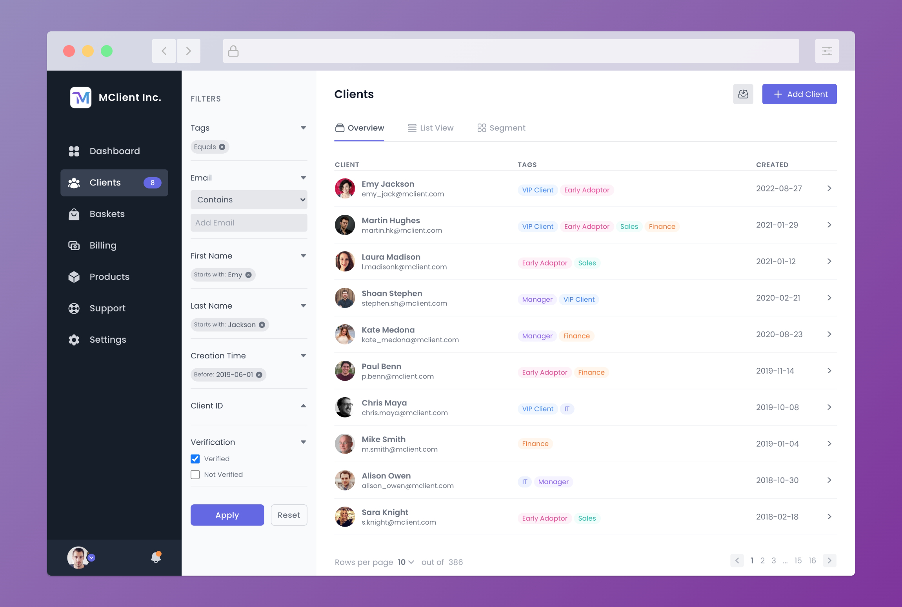

# Tailwindcss Client Dashboard Template (MClient)

A responsive dashboard template for managing and monitoring clients which has been designed with Tailwindcss and Alpine.js.

It's designed to adapt to different screen sizes from mobile phone to extra wide screens.


## Screenshots




## Installation & Development

For furthur development, Tailwindcss and Node.js dependencies need to be installed by npm.

```bash
  npm install 
```

In development, Tailwind CLI will be needed to watch and build the style.css

```bash
  npm run build 
```

## Support & Further Development

Feel free to download, fork and use the template.

More pages are in development to be merged into current template repository.

Show your support and interest by sharing and make it starred.


